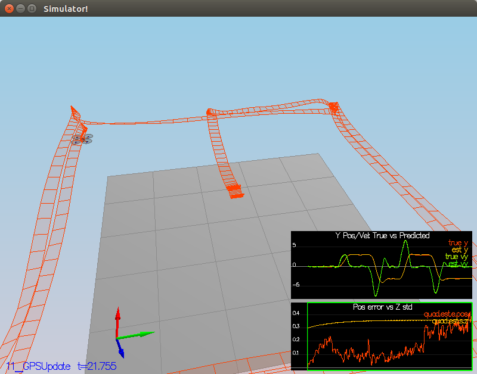

# EKF Estimation Simulator #

Welcome to the estimation project.  In this project, you will be developing the estimation portion of the controller used in the CPP simulator.  By the end of the project, your simulated quad will be flying with your estimator and your custom controller (from the previous project)!

This README is broken down into the following sections:

 - [Setup](#setup) - the environment and code setup required to get started and a brief overview of the project structure
 - [The Tasks](#the-tasks) - the tasks you will need to complete for the project
 - [Tips and Tricks](#tips-and-tricks) - some additional tips and tricks you may find useful along the way
 - [Submission](#submission) - overview of the requirements for your project submission


## Setup ##

This project will continue to use the C++ development environment you set up in the Controls C++ project.

 1. Clone the repository
 ```
 git clone https://github.com/udacity/FCND-Estimation-CPP.git
 ```

 2. Import the code into your IDE like done in the [Controls C++ project](https://github.com/udacity/FCND-Controls-CPP#development-environment-setup)
 
 3. You should now be able to compile and run the estimation simulator just as you did in the controls project

## The Tasks ##

Project outline:

 - [Step 1: Sensor Noise](#step-1-sensor-noise)
 - [Step 2: Attitude Estimation](#step-2-attitude-estimation)
 - [Step 3: Prediction Step](#step-3-prediction-step)
 - [Step 4: Magnetometer Update](#step-4-magnetometer-update)
 - [Step 5: Closed Loop + GPS Update](#step-5-closed-loop--gps-update)
 - [Step 6: Adding Your Controller](#step-6-adding-your-controller)


### Step 1: Sensor Noise ###

I wrote a python script file `src/calculateDEV.py` to read the log file `Graph1.txt` and `Graph2.txt` and extract the sensor data and use numpy to grab the standard deviation.


### Step 2: Attitude Estimation ###

In function `UpdateFromIMU` of `QuadEstimatorEKF.cpp` file, I use a complementary filter to improve nonlinear attitude estimation, first create a quaternion to represent the current attitude and then integrate the gyros measurments to update attitude. The `accelRoll` and `accelPitch` use a little tricks to calculate from accelerometers but need to assume that there is no net force on the vehicle.

Increase the `attitudeTau` to give more weight to integrate from gyros but it tend to drift, usually give 0.05 coeff to accelerometers data to avoid drift.


### Step 3: Prediction Step ###

This step focus on `GetRbgPrime` and `Predict` functions, both need to calculate the jacobi matrix. `GetRbgPrime` is for the rotation matrix and the other is for transititon matrix.


### Step 4: Magnetometer Update ###

In function `UpdateFromMag`, the math and code both are simple. We get global yaw angle direct from magnetometer and just map it the same one as measurment model. But it need to normalize the difference between state and measurment. 
It's not hard to tune the parameter `QYawStd` in `QuadEstimatorEKF.txt`, if it is too small, the estimator would be too sensity and not capture the true noise distribution. If it is too large it would not limit the error in a small range. I test 0.3 is good one.


### Step 5: Closed Loop + GPS Update ###

The code in `UpdateFromGPS` is also simple, just as magnetometer, the main job is tune the parameters in `QuadEstimatorEKF.txt`. Turn off ideal IMU and estimator in `config/11_GPSUpdate.txt`, and tune process noise model parameters.


### Step 6: Adding Your Controller ###

This is a funny step, I replace my implementation of `QuadController.cpp` and `QuadControlParams.txt` but the vehicle even cannot fly. It shaked a lot. But when I detune the position and velocity gains, it perform much better. And some others such as angle gains and yaw control gain also need to process.

Below is my final result.



